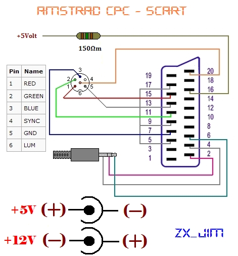
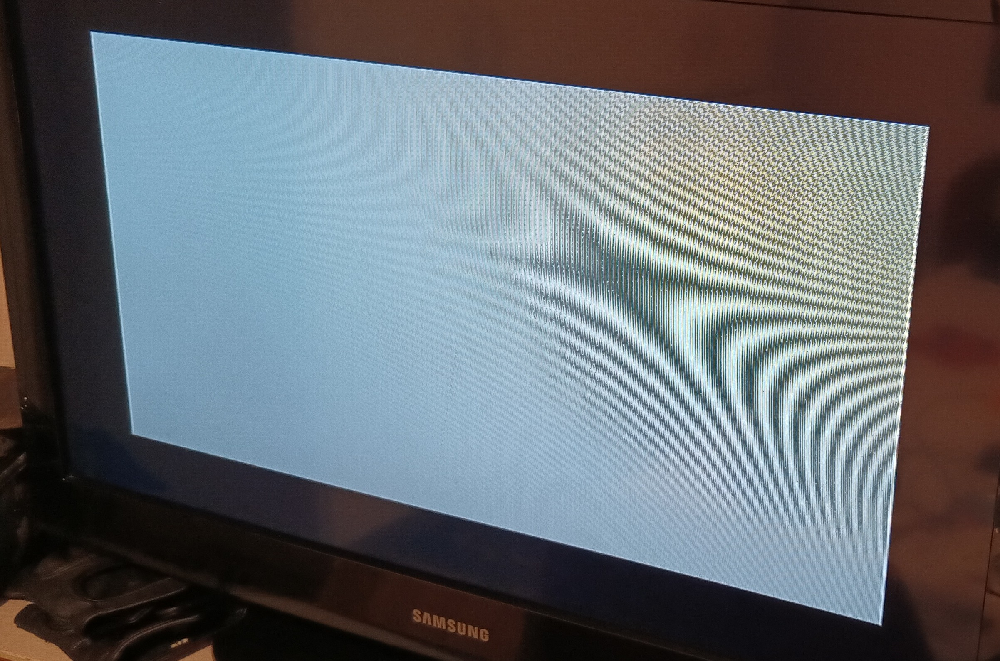
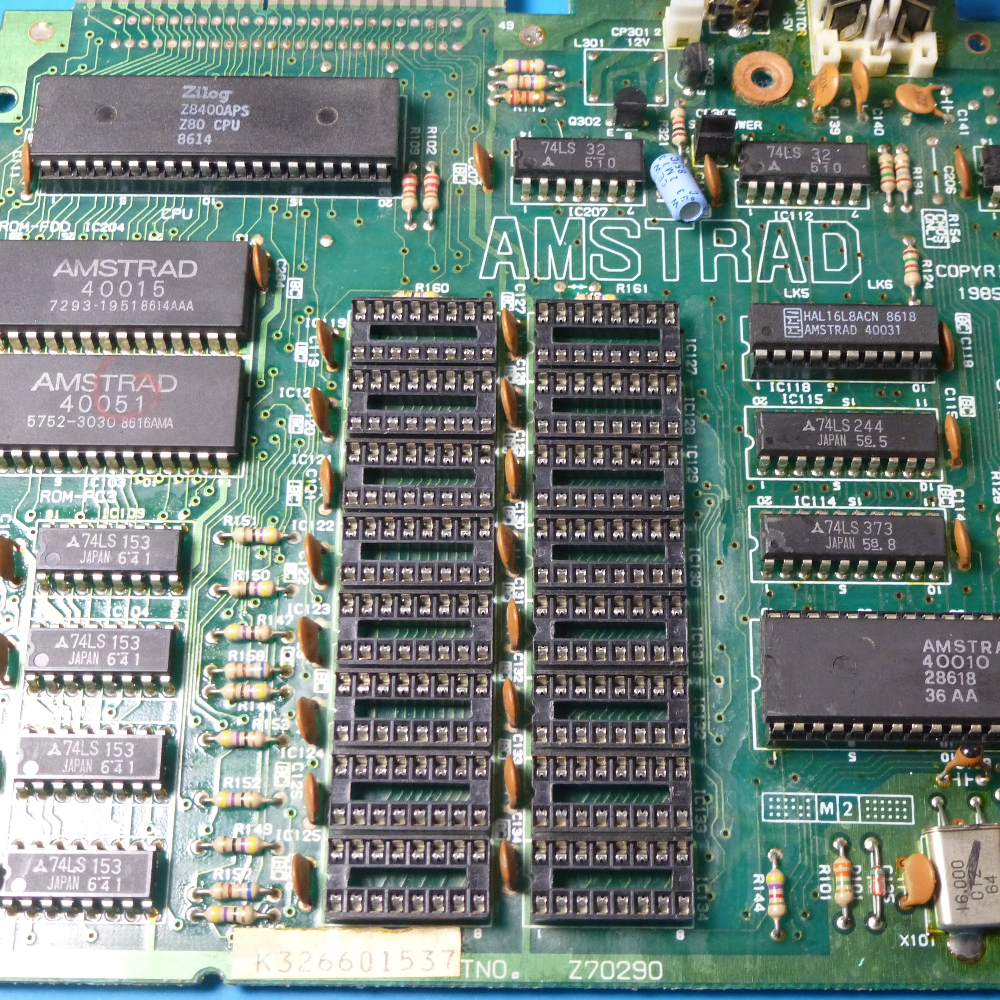
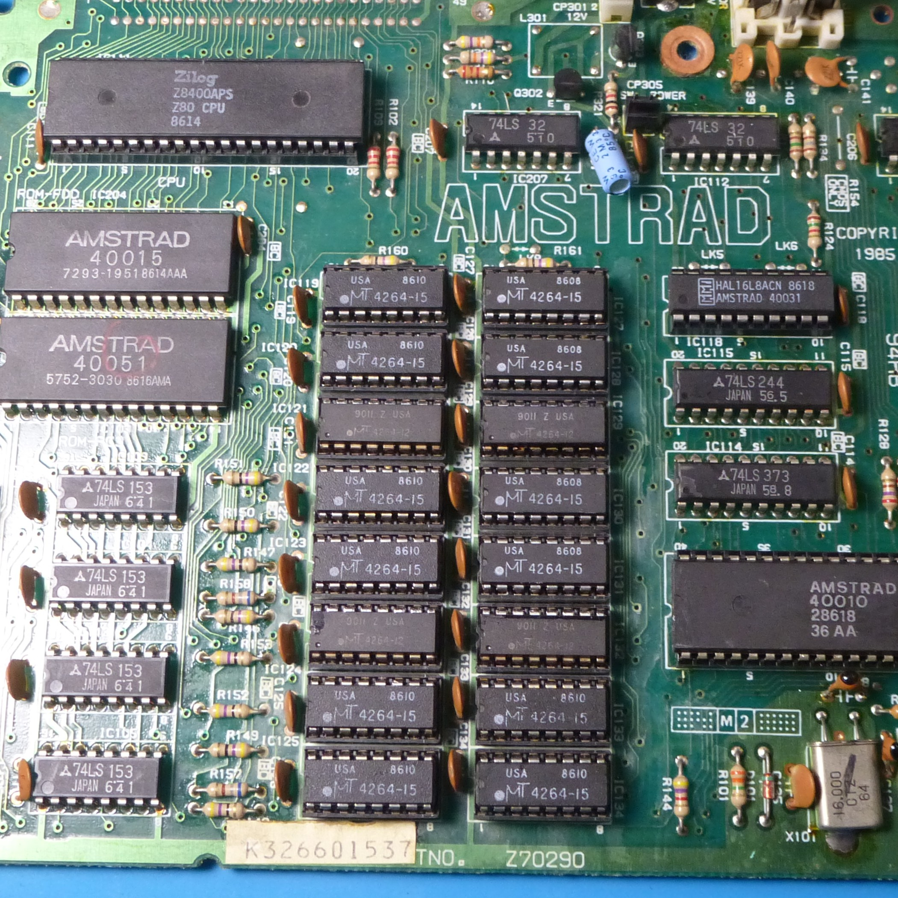
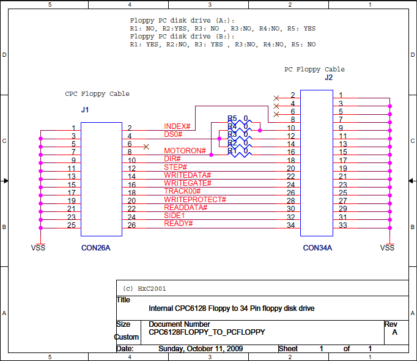
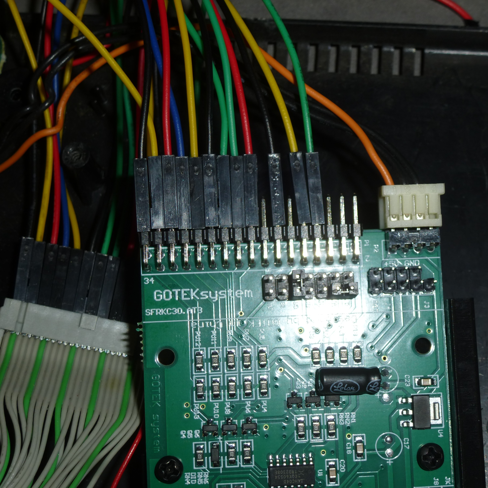
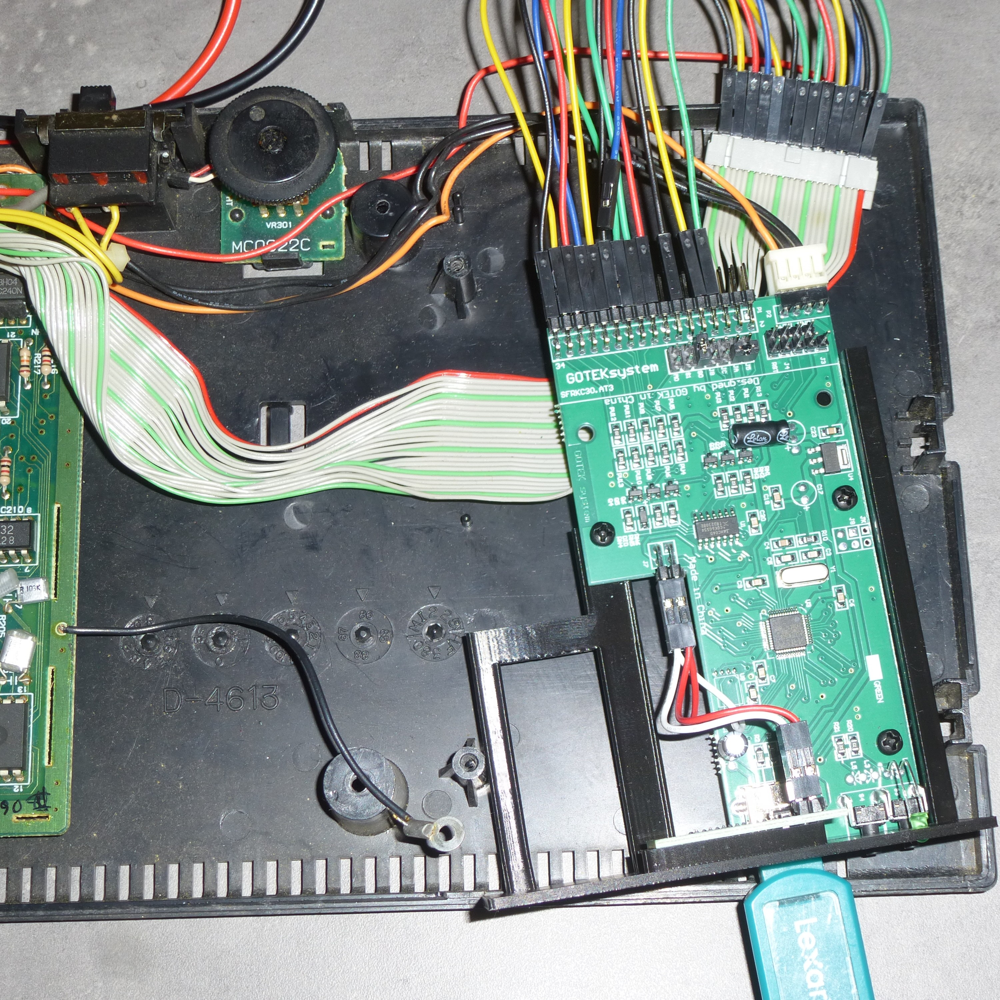

# AmstradCPC6128-gotek

My personal notes on how I diagnosed, fixed an Amstrad CPC 6128, and installed a GOTEK floppy emulator.

## Video Cable

First, I had to make a special cable that converts the DIN 6 video output to SCART so I could check if there was any video output at all.

I found multiple schematics online, but the one I used is this:



Source: [zxjim blog](https://zxjim.blogspot.com/2011/09/amstrad-cpc-rgb-scart.html)

## Diagnosing the Hardware Problem

I knew from the owners that they had used the wrong power supply for the Amstrad. They applied 12V instead of 5V. Most (if not all) of the electronics on the Amstrad, except the floppy drive motor, use a 5V TTL supply. Knowing that, I had to determine what had been damaged by the 12V. I used the video cable for an initial diagnosis. The video output was this:



I used information from various YouTube videos and studied the schematics to help with the diagnosis:

- [Always Check The Basics First - Amstrad CPC Repair](https://www.youtube.com/watch?v=NNPpYy6VT0A)
- [Amstrad CPC 6128 with Black Screen (Part 1)](https://www.youtube.com/watch?v=EyT7gYs--vo)
- [Amstrad CPC 6128 Repair](http://blog.tynemouthsoftware.co.uk/2019/08/amstrad-cpc-6128-repair.html?m=1)
- [Schematic](https://www.cpcwiki.eu/index.php/File:CPC6128_Schematic.png)

After checking a few components, I found that some of the RAM chips were not functioning properly. I ordered six RAM chips from eBay. Since I would be replacing some RAM chips, I decided to remove all of them and install IC sockets for easier replacement in the future.





## GOTEK Installation

This was my excuse to create this repo, as information on this process is scattered across the web. If you follow these steps carefully, you should have no problems.

### What You Will Need

- GOTEK device
- USB A - USB A cable (ensure it supports data transfer)
- 12x Male - Female jumper cables
- A 3D printer to print the mount
- A computer
- Patience

### 1. Hardware Choice

Choose the right model of GOTEK emulator. It is mostly a personal preference, but in this case, I chose the cheapest *compatible* version for around 25 euros from AliExpress (at the time of writing). If you follow the [official guide on choosing the right hardware](https://github.com/keirf/flashfloppy/wiki/Gotek-Models), you will be fine.

Although not necessary, I recommend either buying an OLED version or installing an OLED later on. The OLED makes file selection much easier and enables access to menu options. Usually, buying an OLED and installing it afterward is cheaper, and it's very easy. I won't include installation instructions here, but both the 7-segment and OLED displays use the I2C protocol, and FlashFloppy detects the address automatically.

### 2. Printing the Mount

While waiting for your GOTEK to arrive, you can print the mount. I printed the version *without an encoder* from here: [Amstrad CPC 6128 Gotek Bracket](https://www.printables.com/model/284516-amstrad-cpc-6128-gotek-bracket/files)

**Note:** The bracket above is for the OLED version, but the 7-segment display will also fit if pressed in firmly.

### 3. Flashing FlashFloppy

Once you receive the device, it's time to flash [FlashFloppy](https://github.com/keirf/flashfloppy). The process is straightforward, and there is a detailed guide available.

I recommend soldering the header for the jumpers, as it makes the process easier.

The [official guide](https://github.com/keirf/flashfloppy/wiki/Firmware-Programming) is very detailed. If you are using Linux to program the device, check out [this discussion](https://github.com/keirf/flashfloppy/discussions/698#discussioncomment-3901428) for more details.

### 4. Wiring

After flashing the device, it's time for wiring. I followed this schematic:



Source: [Torlus Forum](https://torlus.com/floppy/forum/viewtopic.php?t=259)

Source: [CPCWiki 765 FDC](https://www.cpcwiki.eu/index.php/765_FDC)

You need to choose the wiring for **Drive A**, which requires connecting only 12 cables. I opted for jumper cables instead of making a ribbon cable because it is much easier and faster. Also, you only need to connect the top part of the ribbon cable since the bottom pins are all grounded. The GOTEK and the Amstrad motherboard handle the grounding on each side.

Lastly, set the **jumper pin on the GOTEK to S0**. This enables the GOTEK to be recognized as **Drive A**.

Source: [RetroWiki](https://www.retrowiki.es/viewtopic.php?t=200034502&start=32)




## Loading Software

### 1. Formatting the USB Drive

You need to format a USB drive as **FAT/FAT32**. I haven't tested other filesystems, so I can't confirm compatibility.

Source: [FlashFloppy Initial Setup](https://github.com/keirf/flashfloppy/wiki/Initial-Setup)

### 2. Loading Games onto the USB Drive

From my experience, many files downloaded from the internet were not recognized by FlashFloppy. I found [this ROM set](https://archive.org/details/amstrad-cpc_202203), which contains many games that are ready to be loaded by FlashFloppy. Simply extract the `.dsk` files to the root directory of the USB drive.

### 3. Running the Games

When you insert the USB drive into the GOTEK, it will automatically mount the first compatible `.dsk` file to the first available slot (e.g., `000`).

To list the contents of the floppy image, type:

```basic
cat
```

Then press *Enter* to print the files.

To run a game, type:

```basic
run "[filename].bin"
```

